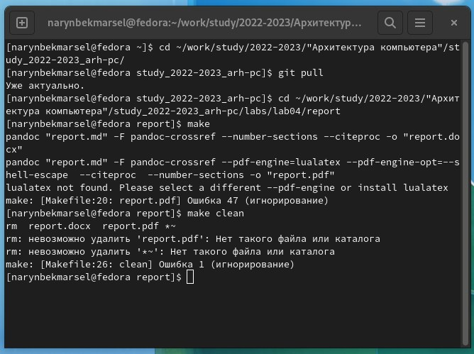

---
## Front matter
title: "Лабораторная работа 4"
author: "Нарынбек Марсел"

## Generic otions
lang: ru-RU
## Bibliography
bibliography: bib/cite.bib
csl: pandoc/csl/gost-r-7-0-5-2008-numeric.csl
## Pdf output format
toc-depth: 2
lof: true # List of figures
lot: true # List of tables
fontsize: 12pt
linestretch: 1.5
papersize: a4
documentclass: scrreprt
## I18n polyglossia
polyglossia-lang:
  name: russian
  options:
	- spelling=modern
	- babelshorthands=true
polyglossia-otherlangs:
  name: english
## I18n babel
babel-lang: russian
babel-otherlangs: english
## Fonts
mainfont: PT Serif
romanfont: PT Serif
sansfont: PT Sans
monofont: PT Mono
mainfontoptions: Ligatures=TeX
romanfontoptions: Ligatures=TeX
sansfontoptions: Ligatures=TeX,Scale=MatchLowercase
monofontoptions: Scale=MatchLowercase,Scale=0.9
## Biblatex
biblatex: true
biblio-style: "gost-numeric"
biblatexoptions:
  - parentracker=true
  - backend=biber
  - hyperref=auto
  - language=auto
  - autolang=other*
  - citestyle=gost-numeric
## Pandoc-crossref LaTeX customization
figureTitle: "Рис."
tableTitle: "Таблица"
listingTitle: "Листинг"
lofTitle: "Список иллюстраций"
lotTitle: "Список таблиц"
lolTitle: "Листинги"
## Misc options
indent: true
header-includes:
  - \usepackage{indentfirst}
  - \usepackage{float} # keep figures where there are in the text
  - \floatplacement{figure}{H} # keep figures where there are in the text
---

# Цель работы
Освоение процедуры оформления отчетов с помощью легковесного языка разметки Markdown.

# Ход работы:
1. Изучил теоретический материал и установил все необходимое для выполнения работы.
2. Перешел в каталог курса сформированный при выполнении лабораторной работы 3. Обновил локальные репозиторий, скачав изменения с помощью команды git pull . Перешел в каталог с шаблоном отчета по лабораторной работе 4. Провел компеляцию компиляцию шаблона с использованием Makefile. Открыл и проверил корректность файлов. Затем удалил их. Мне не удаются создать pdf файл.
{ #fig:fig1 wildth=90%}
Заполняю отчет и проверяю корректность полученных файлов.
Затем загружаю файлы на Github и выполняю задания для самостоятельной работы.
# Выводы
Освоил процедуры оформления отчетов с помощью легковесного языка разметки Markdown
